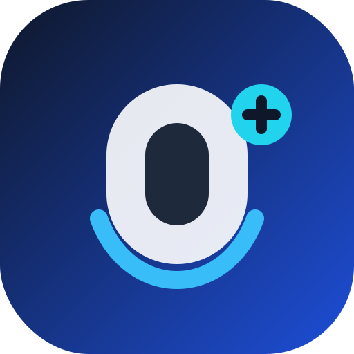

# 🗣️ Stroke Speech

<p align="center">
  
</p>

<p align="center">
  <a href="https://macarthuror.github.io/stroke-speach/"></a>
  
  
  
</p>

> **Aplicación web AAC (Augmentative and Alternative Communication)** enfocada en personas con dificultades del habla, especialmente diseñada para facilitar el proceso de recuperación post-ictus (derrame cerebral).

---

## 🌍 Abstract (English)

**Stroke Speech** is an accessible, Progressive Web App (PWA) designed to provide Augmentative and Alternative Communication (AAC) for stroke survivors and individuals with speech impairments. By utilizing the Web Speech API (Text-to-Speech), it allows users to quickly select customizable word and phrase cards to communicate their daily needs. With a simple, high-contrast UI and full offline support, Stroke Speech aims to bridge the communication gap during rehabilitation, ensuring users have a voice anywhere, anytime.

---

## 🎯 Descripción y Objetivos

**Stroke Speech** permite crear, personalizar y reproducir tarjetas de comunicación por voz para necesidades rápidas de uso diario.

**Objetivos clave:**

- **Comunicación inmediata:** Facilitar la expresión mediante tarjetas de palabras y frases preconfiguradas.
- **Accesibilidad máxima:** Interfaz simple, clara, de alto contraste y con áreas táctiles grandes.
- **Disponibilidad total:** Funcionar como PWA instalable con soporte 100% offline.

---

## ✨ Características Principales

- 🗂️ **Tarjetas Personalizables:** Crea y organiza tarjetas de palabras y frases.
- 🔊 **Síntesis de Voz (TTS):** Reproducción nativa en español usando `SpeechSynthesis`.
- 🎨 **Identificación Visual:** Selector de color y soporte de emojis por tarjeta.
- 🗑️ **Gestión Segura:** Modo "eliminar" controlado desde el header para evitar toques accidentales.
- 📱 **Experiencia Nativa (PWA):** Instalable en escritorio (Chrome/Edge) y móvil (Android/iOS mediante A2HS).
- 📶 **Modo Offline:** Soporte sin conexión a internet garantizado por Service Workers.
- 🔄 **Auto-Update:** Actualización automática de la PWA tras nuevos despliegues.

---

## 🏗️ Arquitectura y Rutas

La aplicación está diseñada con una navegación plana para evitar que el usuario se pierda:

- `/` ➔ Tarjetas de palabras (Inicio)
- `/phrases` ➔ Tarjetas de frases complejas
- `/settings` ➔ Ajustes generales (Voz, visualización)
- `/about` ➔ Información del proyecto

---

## 💻 Tecnologías Usadas

Este proyecto está construido con un stack moderno y enfocado en el máximo rendimiento:

**Framework y UI:**

- [Nuxt 4](https://nuxt.com/) & [Vue 3](https://vuejs.org/)
- [Nuxt UI](https://ui.nuxt.com/) & [Tailwind CSS 4](https://tailwindcss.com/)

**PWA y Rendimiento:**

- `@vite-pwa/nuxt` & [Workbox](https://developer.chrome.com/docs/workbox/)

**Utilidades:**

- [VueUse](https://vueuse.org/) (`@vueuse/core`, `@vueuse/nuxt`)
- `vue3-emoji-picker`

**Calidad y Testing:**

- TypeScript, ESLint, Vitest, Vue Test Utils

---

## 🚀 Instalación y Desarrollo Local

**Requisitos previos:**

- [Node.js](https://nodejs.org/) 22+
- [pnpm](https://pnpm.io/) 10+

**Pasos de instalación:**

```bash
# 1. Instalar dependencias
pnpm install

# 2. Iniciar servidor de desarrollo
pnpm dev
```
